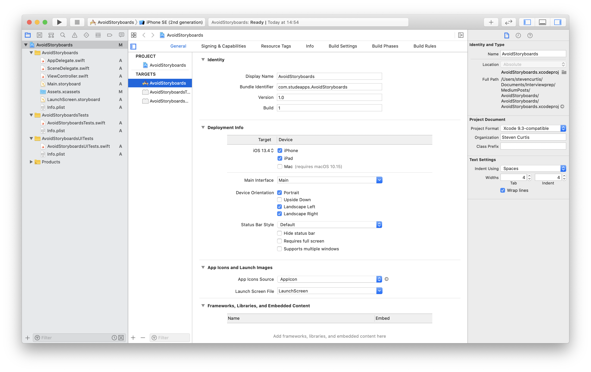
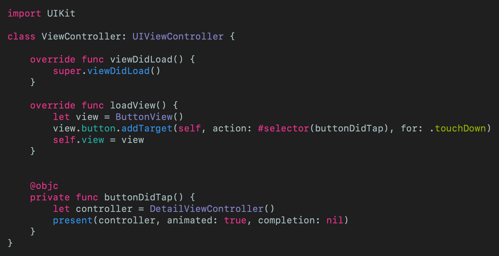
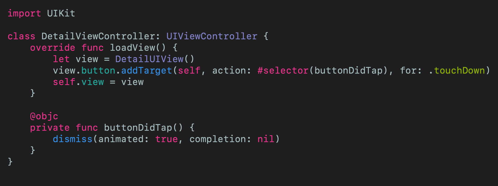
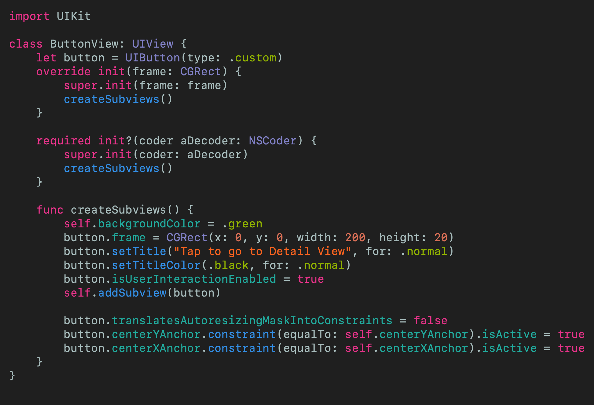
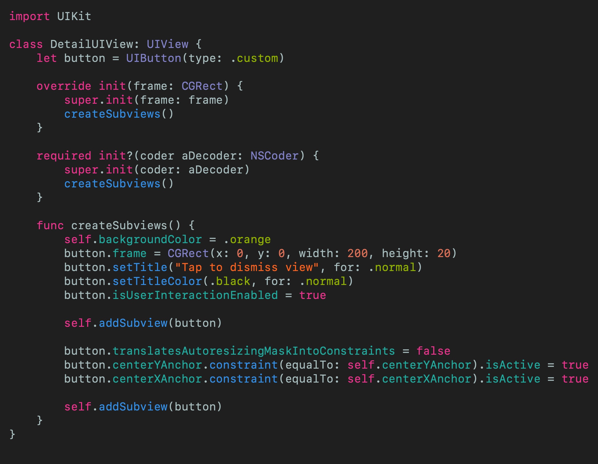
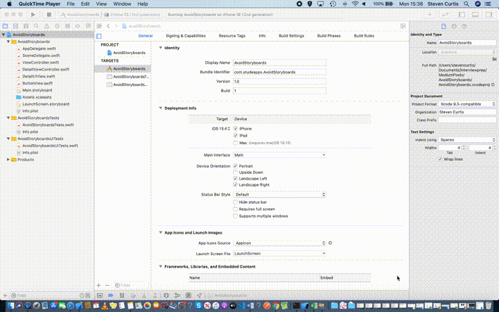
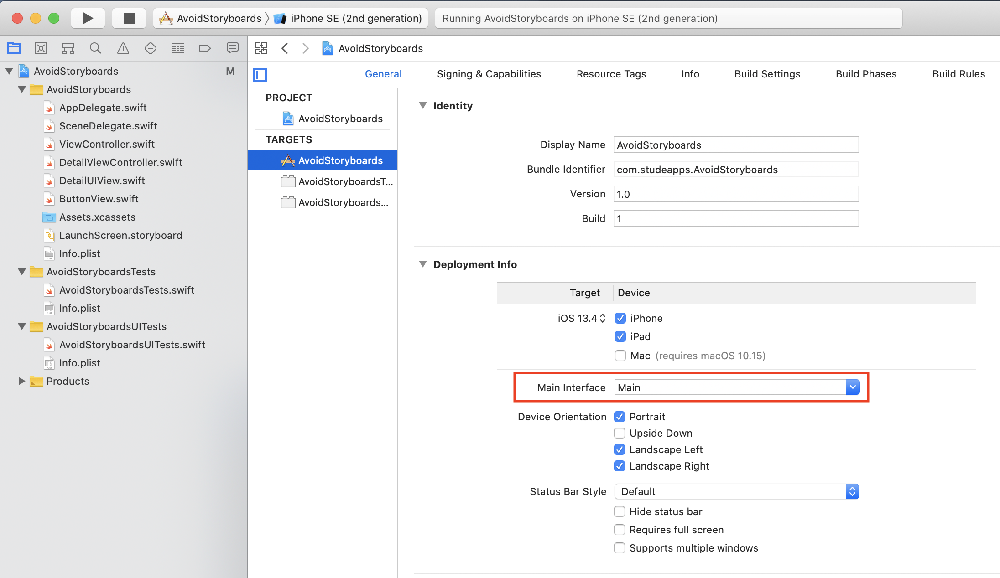
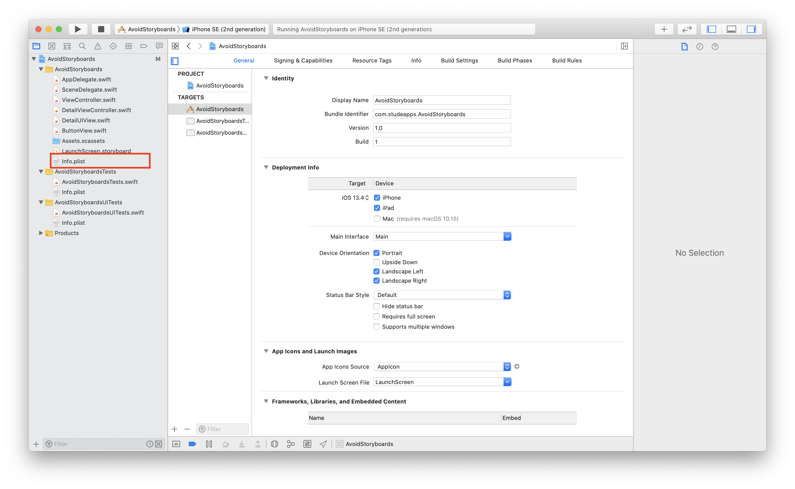
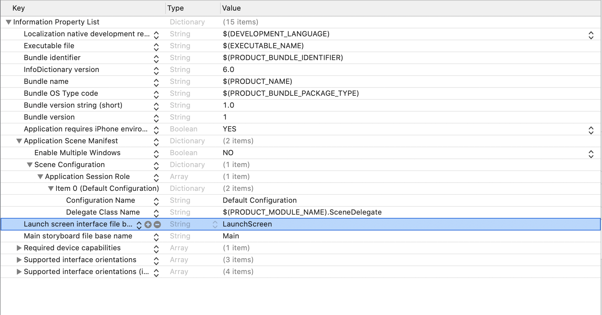
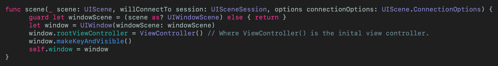

# Avoid Storyboards in Your Apps!
## Get rid of Xcode's boilerplate

 
Photo by Jamie Street on Unsplash

I've written an  [article](https://medium.com/@stevenpcurtis.sc/write-clean-code-by-overriding-loadview-ac4f172163d0) spelling out the advantages of using loadView() instead of using Storyboards. This is great, and people appreciate the article. 

The problem? The article works with Playgrounds and a Single View Application in Xcode assumes that you are going to use a Storyboard, and deleting it gives an error. What a mistake.

To get rid of those annoying storyboards, read on.

Difficulty: Beginner | **Easy** | Normal | Challenging
This article has been developed using Xcode 11.4.1, and Swift 5.2.2

## Prerequisites: 
* This article has been written to allow you to write code using loadView() like in my [article](https://medium.com/@stevenpcurtis.sc/write-clean-code-by-overriding-loadview-ac4f172163d0) featuring Playgrounds. You will be expected to be aware how to make a [Single View Application](https://medium.com/swlh/your-first-ios-application-using-xcode-9983cf6efb71) in Swift.

## Terminology
Storyboards: A visual representation of the User Interface of an Application

## The challenge
Once you have created a [Single View Application](https://medium.com/swlh/your-first-ios-application-using-xcode-9983cf6efb71) you are presented with something like the following image:

What's the problem? Can you see on the left hand side? Beside the *projects*? We have a Storyboard there - and the whole point is we aren't going to be using it. If we delete it, we won't get any further than a blank screen on the Simulator followed by an **NSInvalidArgumentException**. That's not great at all.

# The step-by-step

I'm going to arrange my classes much like the [loadview article](https://medium.com/@stevenpcurtis.sc/write-clean-code-by-overriding-loadview-ac4f172163d0)

## The classes
I can list the code for these classes (now I prefer to download these from the [Repo](https://github.com/stevencurtis/AvoidStoryboardsBlog) but there you go), but I'm leaving the explaination with the original article [loadview article](https://medium.com/@stevenpcurtis.sc/write-clean-code-by-overriding-loadview-ac4f172163d0) as these are basically just created to give us some code to test during the process. In other words, don't panic!

ViewController 

DetailViewController 

ButtonView 

DetailUIView 

## Getting rid of the storyboard
In order to do this, we can just delete the `Main.storyboard` file with the friendly-looking backspace key on your keyboard. Just select the file, then press delete. I know you can do it. GO ON.

## Remove references to storyboard
There is a link to the storyboard in the pList file AND in the deployment info. We don't want either of those, so we are going to get rid of them with our delete-me-do button.

### Remove Deployment info reference
When you select the target on the left-hand side of the project inspector then you will see a dropdown saying *Main* now (and pay attention) GET RID of it. Another delete will get rid of the link. No problem (right?).

### Info.plist reference
In the project inspector there is a rather lovely info.plist file. Select it, and I'll see you just after the image. DON'T DELETE IT - We will modify it.

The part to delete is buried inside a rather annoying set of drop-down lists. We are looking for the creatively-named **Storyboard Name** and we can delete that line entirely. This will get rid of the entire key and value.
You'll be left with something like this:

Yes - I did find it tricky to select a deleted row, so there isn't too much I can do about that (sorry)

## Point the code to the rootViewController
`scene(_:willConnectTo:options:)` needs to be adjusted. By adjusted, I do of course mean that we need to change the entire body of the function.
The function lives in the SceneDelegate.swift file, which can also be selected from the files on the left-hand side of the project. 
When you've got that selected our target function will be at the top of the file) - just replace it with the following:

and...we are job done.

# Conclusion

Phew. There are quite a few steps to go through in order to get rid of that (rather annoying) file. You might be tempted to leave it - but that would be a mistake. You're not shipping extra code that shouldn't be in your bundle, right? 
Anyway, at least you have the tools to avoid this from now. All the best!
If you've any questions, comments or suggestions please hit me up on [Twitter](https://twitter.com/stevenpcurtis) 
